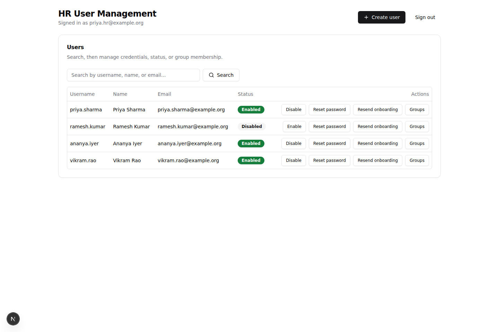
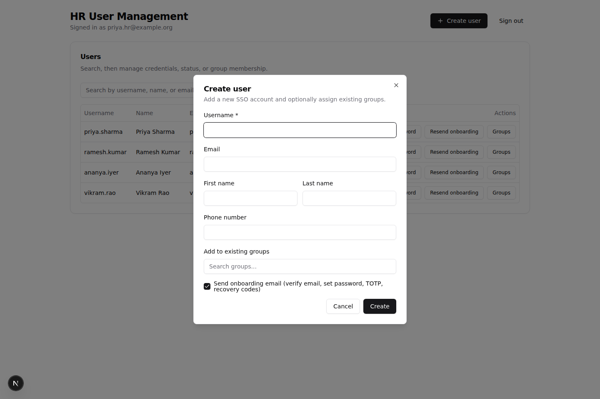
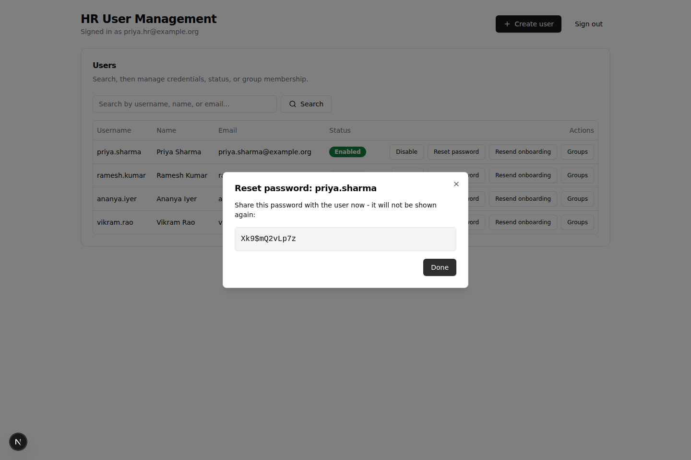
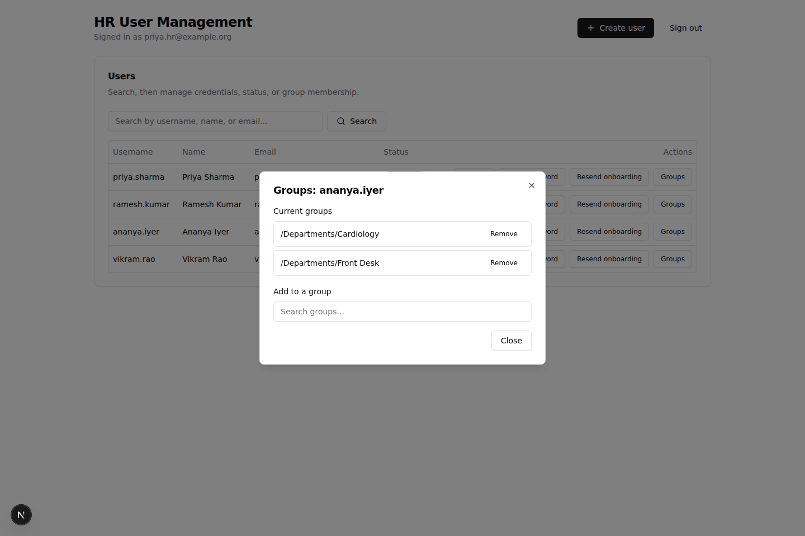
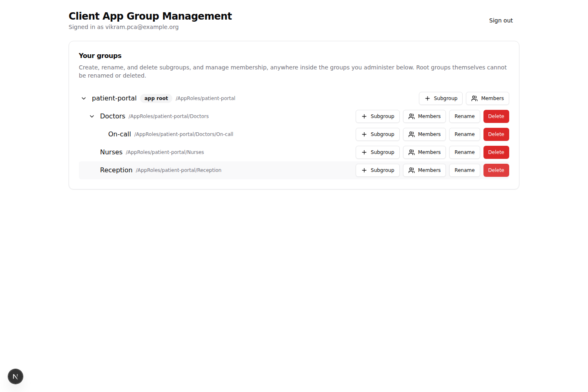
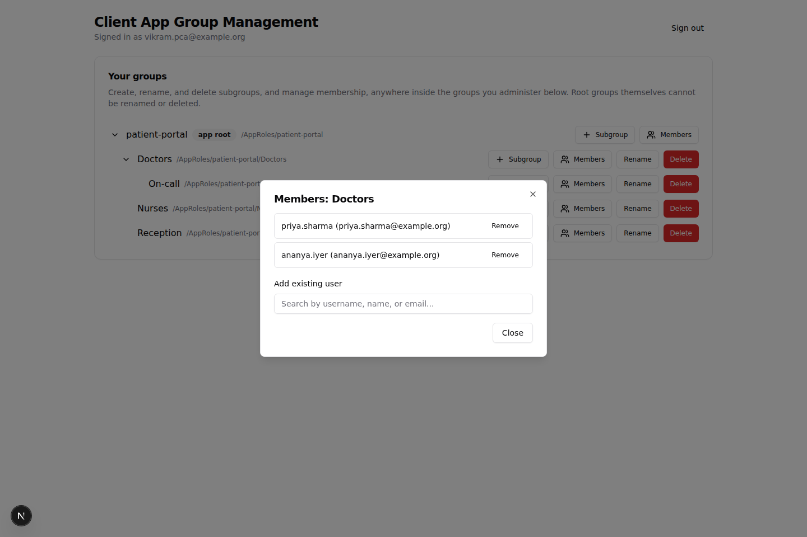

# Admin Console

Standalone Next.js app providing two self-service dashboards on top of the Keycloak realm managed by this repository. It is a separate deployable from Keycloak itself - it authenticates the signed-in user via Keycloak OIDC and then calls the stock Keycloak Admin REST API directly with that user's own access token. It grants no privilege of its own: every read/write is authorized by Keycloak's existing FGAP v2 permissions and the `custom-delegated-admin-guard-spi` filter already deployed in the realm.

## Dashboards

- `/hr` - for holders of the `user-manager` realm role: a two-pane, paginated user directory and selected profile/create/edit workspace. Its advanced filters are collapsed by default and cover expiry range, exact Employee ID, phone/account status, group membership, `/User Type` membership, and administrative access. Realm Admin, Client Manager, User Manager, and custom direct `/AppRoles/{application}` App Admin access are prominent in both directory cards and profile detail. Checkboxes drive bulk enable, disable, and onboarding resend. It also edits the configured profile fields, resets credentials, and assigns/removes existing group membership. Group creation is intentionally out of scope for this role. Profile controls are defined in `src/lib/userProfileFields.ts` and must be updated in Git when the realm schema changes. Phone verification is view-only and can become true only through user OTP validation.
- The create and edit workspaces have a protected HRMS source pane. A manager enters an Employee ID and fetches the source record; the server-side, version-controlled mapper proposes an editable Keycloak draft in the other pane. Nothing is written until the manager submits the normal create/save action, which re-fetches HRMS server-side rather than trusting browser-supplied source data. The retained extension record stores the HRMS Employee ID, date of birth, parent names, and final five PAN characters; unrelated HRMS payroll and demographic fields are discarded.
- `/groups` - a full-width, three-workspace Groups dashboard. Its group workspaces use live-filtered columns for parent groups/applications, recursively nested child groups/roles, and direct members. The member column includes the selected group's full breadcrumb. `user-manager` and realm admins can browse institute-wide groups, inspect all application roles, and audit a user's memberships. `user-manager` can manage memberships but not application-role structure.
- Delegated administrators see only owned `AppRoles/{clientId}` applications. Each application-role card shows its direct-member count and opens the exact user list, so delegates can see and manage which users hold which roles in their own applications. Institute-wide groups and user audit are not exposed to delegates.
- Holders of `realm-management -> realm-admin` have full access to both dashboards and all application roots.
- `/register` - an unauthenticated but LAN-only EHRMS self-registration page. It shows masked EHRMS contacts, performs server-side duplicate checks, and creates the account through a separate restricted Keycloak service client. See [`docs/SelfRegistration.md`](../docs/SelfRegistration.md).
- `/audit` - available only to `realm-management -> realm-admin`. It shows a filterable, paginated log of mutations made through this application. Entries contain actor and target Keycloak UUIDs, action, outcome, and a redacted summary; passwords, tokens, full PAN values, and complete HRMS responses are never logged.

Visiting `/` redirects realm administrators to `/hr`; other users are routed to the dashboard matching their application role or shown a missing-role message.

## Screenshots

Rendered with sample data (not a real realm) purely to preview the UI.

| | |
|---|---|
|  HR dashboard |  Create user |
|  Reset password |  Manage groups |
|  Client app group management |  Group members |

## Stack

Next.js (App Router) + TypeScript, NextAuth v4 for OIDC login, Tailwind CSS + [shadcn/ui](https://ui.shadcn.com) (`components.json`, `src/components/ui/`) for the UI, and `sonner` for toast notifications. The `shadcn` CLI itself needs network access to `ui.shadcn.com` to add further components (`npx shadcn@latest add <component>`) - the components already present were added by hand against the same registry source, so this still works in environments where that host is reachable.

## Why a separate app

Both roles already carry the permissions this UI exposes:

- `user-manager` already has FGAP `manage` scope on `Users` and `manage-group-membership`/`manage-membership` on `Groups`.
- `delegated-client-admin-base` is already scoped to its own `AppRoles/{clientId}` subtree by `DelegatedAdminGuardFilter` at the HTTP layer, on top of FGAP.

So this app is a curated UI over capability that already exists, not a new privilege surface. Every ownership/role check performed in `src/lib/ownership.ts` and `src/lib/session.ts` is a UX convenience (clear early error messages) - the authoritative decision is always Keycloak's.

## Configuration

For Docker Compose, copy the repo root `.env.admin-console.template` to `.env.admin-console`. For local development outside Docker Compose, copy `.env.local.example` to `.env.local` and adjust as needed.

Two Keycloak URLs are configured separately to support running inside docker compose:

- `ADMIN_CONSOLE_KEYCLOAK_PUBLIC_URL` - reachable from the end user's browser (OIDC login/logout redirects).
- `ADMIN_CONSOLE_KEYCLOAK_INTERNAL_URL` - reachable from this app's server process (token exchange + all Admin REST calls). Inside docker compose this is the internal service address `http://keycloak:8080`.

### Admin application database

The app uses a separate `sso_admin` database on the same PostgreSQL server. Keycloak's database remains private to Keycloak. Drizzle owns the committed schema and migrations under `drizzle/`; production containers apply them before the app starts.

```bash
make admin-console-db-provision
make admin-console-db-migrate
```

Set `ADMIN_CONSOLE_DB_NAME`, `ADMIN_CONSOLE_DB_USER`, `ADMIN_CONSOLE_DB_PASSWORD`, and `ADMIN_CONSOLE_DATABASE_URL` in the gitignored `.env.admin-console`. Use `npm run db:generate` after intentional schema changes and commit the TypeScript schema and generated SQL.

The database is not a Keycloak profile copy. It stores only app-owned extension data, additional contact identifiers, and the mutation audit log. The Keycloak user UUID remains the authoritative identity key.

## Local development

```bash
cd admin-console
npm install
cp .env.local.example .env.local   # then edit as needed
npm run dev
```

The app listens on `http://localhost:3100` by default.

## Docker compose

The app is excluded from normal stack startup and runs only under the `admin-console` Compose profile. Configure its confidential OIDC client manually as documented in `docs/AdminConsole.md`, copy `.env.admin-console.template` to `.env.admin-console`, then run `make admin-console-build` and `make admin-console-up`.

With `docker-compose.override.yml`, the `admin-console` service runs `next dev` in HMR mode. The host `./admin-console` directory is mounted at `/app`, while `node_modules` and `.next` use isolated named volumes so source edits reload without rebuilding the image. The base `docker-compose.yml` remains production-oriented and runs the standalone Next.js image.

## Exposure

This is an admin surface (user creation, password resets, group membership) and must never be reachable from the public internet or from a public-facing reverse proxy.

`docker-compose.yml` publishes it on `127.0.0.1` only by default (`ADMIN_CONSOLE_BIND_IP` in `.env.admin-console.template`). Two deployment shapes:

- **Reverse proxy on the same docker host:** leave `ADMIN_CONSOLE_BIND_IP` at its default (`127.0.0.1`) and proxy to `127.0.0.1:ADMIN_CONSOLE_PORT`.
- **Reverse proxy on a separate host** (e.g. a LAN-only nginx that is distinct from a public/global-facing nginx, both of which reach this VM on the same single ingress IP for their respective services): set `ADMIN_CONSOLE_BIND_IP` to this VM's ingress IP, and at the docker host's own firewall accept connections to `ADMIN_CONSOLE_PORT` only from the LAN reverse proxy's source IP, denying everyone else on that port - including the global nginx. The bind address by itself is not access control once it's not `127.0.0.1` - the firewall's source-IP rule is what actually keeps everything else out. This only works if the LAN nginx and the global nginx present different source IPs to this VM (distinct hosts, as is the case here); if they ever shared a source IP this approach wouldn't distinguish them and a different mechanism would be needed. This app's vhost must only ever be added to the LAN-facing proxy, never the public/global one.

See [`nginx-confs/hr-admin-console.conf`](../nginx-confs/hr-admin-console.conf) for a proposed vhost for the separate-host/LAN-proxy shape (placeholders: hostname, this VM's ingress IP, TLS cert paths).

### Where to enforce the source-IP restriction

Either of these enforces the same rule - allow only the LAN reverse proxy's source IP to reach this VM's ingress IP on `ADMIN_CONSOLE_PORT`, deny every other source (including the global/public reverse proxy) - just at different points in the path:

- **Network-level firewall (recommended if available):** if there is a zone-aware firewall upstream of the docker VM (separate from the VM itself) that can filter by source zone/IP to a destination IP:port, enforce it there. This is the cleaner option: the restriction applies before traffic ever reaches the VM's NIC, so it entirely sidesteps the Docker/ufw ordering issue below, since there is no local iptables interaction to fight with. This should be the primary control if you have it.
- **Host-level (ufw on the VM):** useful as defense in depth on top of the network firewall, or as the only control if there is no upstream firewall capable of this. Has the Docker interaction described below, so it needs the `DOCKER-USER`-chain approach rather than a plain `ufw allow/deny`.

### Firewall rule (ufw): important Docker gotcha

`ADMIN_CONSOLE_PORT` is published by Docker via a `-p` port mapping (that's what the `ports:` entry in `docker-compose.yml` does). Docker manages that by inserting its own iptables rules directly into the `DOCKER-USER`/`DOCKER` chains, and those rules are evaluated **before** ufw's normal `INPUT` chain. A plain `ufw allow from <ip> to any port ...` / `ufw deny <port>/tcp` pair looks correct but **does not actually restrict a docker-published port** - traffic still gets through, because it never reaches the ufw rule that would have blocked it. This is a well-known ufw+Docker interaction, not specific to this app.

The correct way to restrict a docker-published port with ufw is to add the rule to the `DOCKER-USER` chain, which Docker guarantees always runs first. Edit `/etc/ufw/after.rules` and add this immediately before the file's final `COMMIT` line:

```
*filter
:DOCKER-USER - [0:0]
-A DOCKER-USER -p tcp --dport 3100 -s <LAN_NGINX_IP> -j RETURN
-A DOCKER-USER -p tcp --dport 3100 -j DROP
COMMIT
```

Replace `<LAN_NGINX_IP>` with the LAN reverse proxy's real source IP, and `3100` with `ADMIN_CONSOLE_PORT` if you changed it from the default. Apply with:

```bash
sudo ufw reload
```

Verify it actually took effect from a host that is *not* the LAN nginx box - a connection attempt to `<VM_IP>:3100` should time out / be refused, while the same request from the LAN nginx box's IP should succeed. Re-check after any Docker or ufw upgrade/restart, since Docker rewrites its iptables rules on every daemon restart and can reorder things relative to manually-added chains.

`ADMIN_CONSOLE_APP_URL` (this app's own public URL, e.g. an internal-only subdomain) is independent of `ADMIN_CONSOLE_KEYCLOAK_PUBLIC_URL` (Keycloak's own public URL) - they can and should be different hostnames. Only `ADMIN_CONSOLE_APP_URL` needs to match the reverse-proxy hostname you choose; nothing about Keycloak's own hostname configuration changes.

## Type-checking / build

```bash
npm run typecheck
npm run build
```
